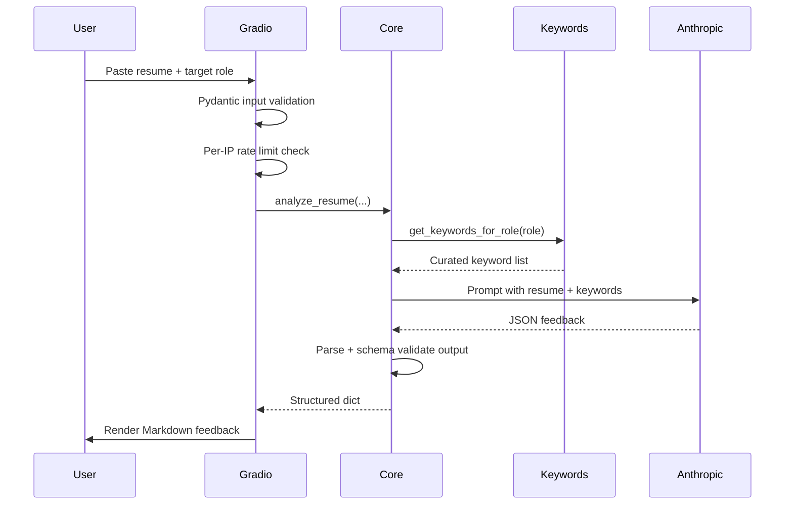

# Desk Review — Architecture

Short reference for how the app works and why it is built this way.

## Request flow

## Components

### Gradio UI (`app.py`)

- Gradio Blocks form for resume, target role, and optional job description
- `GET /healthz` — liveness probe on Gradio's underlying FastAPI app

Responsibilities: validation, per-IP rate limiting, logging (metadata only, no PII), calling `core.analyze_resume`, and rendering results as Markdown.

### Analysis core (`core.py`)

Config, Pydantic schemas, Anthropic client with retries, and `analyze_resume` — shared business logic with no web-framework imports.

### Keyword retrieval (`keywords.py`)

**Why it exists:** Large language models can hallucinate “missing skills” that are irrelevant to a role. A small, hand-curated role → keyword map gives the model a **grounded checklist** of terms to evaluate against the resume.

This is intentionally lightweight retrieval — not RAG over documents:

| Approach | Pros | Cons |
|----------|------|------|
| Hand-curated keywords (current) | Fast, no infra, easy to explain in interviews | Limited roles, manual upkeep |
| Vector DB over job postings | Broader coverage | More complexity, embedding cost |
| No retrieval | Simpler | Less consistent keyword suggestions |

**Lookup logic:** Normalize the role string → exact match → partial substring match → generic fallback keywords.

## Error handling

| User-facing message | When |
|-------|------|
| Validation failed | Invalid input (Pydantic) |
| Rate limit exceeded | Per-IP limit in Gradio handler |
| AI returned malformed data | Unparseable or schema-invalid AI output |
| AI service is busy / unavailable / timed out | Anthropic API errors |

## Security model

- `ANTHROPIC_API_KEY` is read only on the server — never logged or sent to the browser

## Interview talking points

1. **Defense in depth:** validate on input (Pydantic), enforce rate limits, and validate AI output again before display.
2. **Retrieval without over-engineering:** `keywords.py` shows grounding without jumping to a vector DB on day one.
3. **Operational hygiene:** rate limits, retries, timeouts, and no PII in logs.
