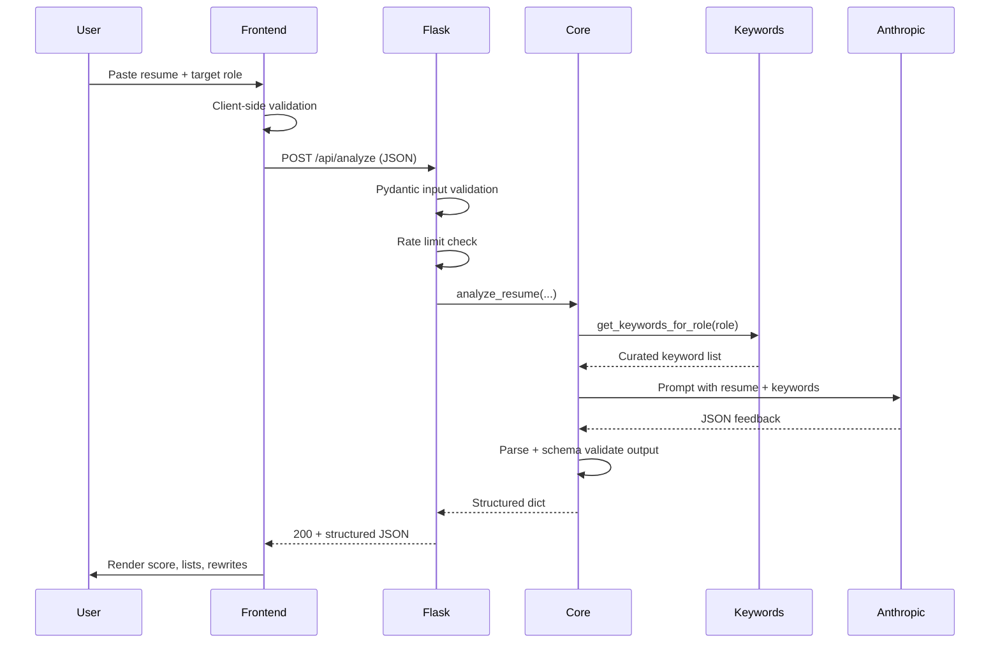

# Desk Review — Architecture

Short reference for how the app works and why it is built this way.

## Request flow

## Components

### Frontend (`templates/`, `static/`)

Single-page form. Validates input before submit, shows inline errors, disables the button with a spinner during the API call, and handles network errors plus malformed server responses (HTTP 502 with `INVALID_MODEL_OUTPUT`).

### Flask API (`app.py`)

- `POST /api/analyze` — main endpoint
- `GET /` — serves the UI
- `GET /healthz` — liveness probe for Render health checks (`@limiter.exempt`)

Responsibilities: validation, rate limiting, logging (metadata only, no PII), calling `core.analyze_resume`, and mapping errors to HTTP status codes.

### Analysis core (`core.py`)

Config, Pydantic schemas, Anthropic client with retries, and `analyze_resume` — shared business logic with no web-framework imports.

### Keyword retrieval (`keywords.py`)

**Why it exists:** Large language models can hallucinate “missing skills” that are irrelevant to a role. A small, hand-curated role → keyword map gives the model a **grounded checklist** of terms to evaluate against the resume.

This is intentionally lightweight retrieval — not RAG over documents:

| Approach | Pros | Cons |
|----------|------|------|
| Hand-curated keywords (current) | Fast, no infra, easy to explain in interviews | Limited roles, manual upkeep |
| Vector DB over job postings | Broader coverage | More complexity, embedding cost |
| No retrieval | Simpler | Less consistent keyword suggestions |

**Lookup logic:** Normalize the role string → exact match → partial substring match → generic fallback keywords.

## Error handling

| Status | When |
|--------|------|
| 400 | Invalid JSON or failed input validation |
| 429 | Rate limit exceeded (Flask-Limiter) |
| 502 | Unparseable or schema-invalid AI output |
| 503 | Anthropic rate limit or 5xx after retries |
| 504 | Anthropic timeout |

## Security model

- `ANTHROPIC_API_KEY` is read only on the server — never logged or sent to the frontend
- CORS is opt-in via `CORS_ORIGINS` for split frontend/backend hosting

## Interview talking points

1. **Defense in depth:** validate on client (UX), server (security), and again on AI output (reliability).
2. **Retrieval without over-engineering:** `keywords.py` shows grounding without jumping to a vector DB on day one.
3. **Operational hygiene:** rate limits, retries, timeouts, and no PII in logs.
